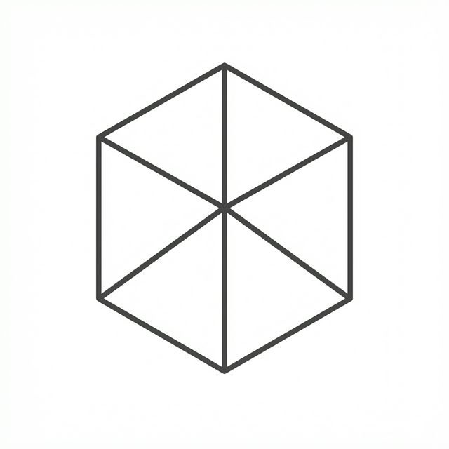

# TopoLink

<p align="center">
  
</p>

> [!WARNING]
> **Currently under active development**  
> Tool is not yet fully functional with many bugs.

TopoLink is a specialized **Bijective Meshing Tool** built with Qt5 and OpenCASCADE. It provides a structured workflow for bridging CAD geometry and discretized mesh structures through interactive topological definition.

## ✨ Latest Updates

- **New App Icon**: Minimalist, high-contrast mesh identity.
- **Workflow Workbenches**: Dedicated environments for Geometry, Topology, and Smoothing.
- **Advanced Topology Tools**: Interactive node manipulation, edge pulling, and face refinement.
- **Propagation Logic**: Edge subdivisions automatically sync across parallel topological paths.
- **Persistence Layer**: Save and load `.topolink` project state.

## 🛠 Workbenches

### 1. Geometry Definition (`R`)
- Import STEP files and map internal OCCT entity IDs.
- Organize geometry into named groups (Edges/Faces).
- Configure visibility and translucent rendering for complex parts.

### 2. Topology Definition (`T`)
- **Node Creation**: Place topology nodes constrained to geometric entities.
- **Constraint Derivation**: Nodes automatically slide along or lock to linked geometry.
- **Visual Editing**: Drag nodes, merge nodes, and pull edges to generate topology faces.
- **Refinement**: Local subdivision control for mesh density.

### 3. Smoother & Export (`Y`)
- Run Elliptic solvers (e.g., TFI) on the topology faces.
- Visualize resulting interior mesh distributions.
- Prepare for downstream simulation export (WIP).

## ⌨️ Keyboard Shortcuts

| Category | Action | Shortcut |
|----------|--------|----------|
| **View Control** | Fit View | `F` |
| | Align to Axis | `A` |
| **Workflow** | Geometry Workbench | `R` |
| | Topology Workbench | `T` |
| | Smoother Workbench | `Y` |
| **Selection** | Toggle Vertex Selection | `Q` |
| | Toggle Edge Selection | `W` |
| | Toggle Face Selection | `E` |
| **File** | Import STEP | `Ctrl+O` |
| | Save Project | `Ctrl+S` |
| | Load Project | `Ctrl+L` |

## 🖱 Mouse Controls

| Action | Control |
|--------|---------|
| **Rotate** | Left-click + drag |
| **Pan** | Middle-click + drag or Shift + left-click |
| **Zoom** | Scroll wheel |
| **Select** | Left-click (on model / HUD) |
| **Topology** | Drag Node / Pull Edge |

## 🚀 Installation & Build

### Requirements
- **Qt5** (Widgets, Core, Gui)
- **OpenCASCADE** (OCCT 7.x)
- **CMake** 3.16+
- **Python 3** (for helper script)

### Build & Run
The simplest way to build and launch on macOS/Linux/Windows:
```bash
python3 start_gui.py
```

## 📂 Project Structure

```
TopoLink/
├── CMakeLists.txt       # Core build logic
├── resources.qrc        # App assets (icons)
├── src/
│   ├── main.cpp         # Entry
│   ├── core/            # Algorithms & Data Model
│   └── gui/             # HUD, Docks, and 3D Viewers
```

## ⚖️ License

MIT
